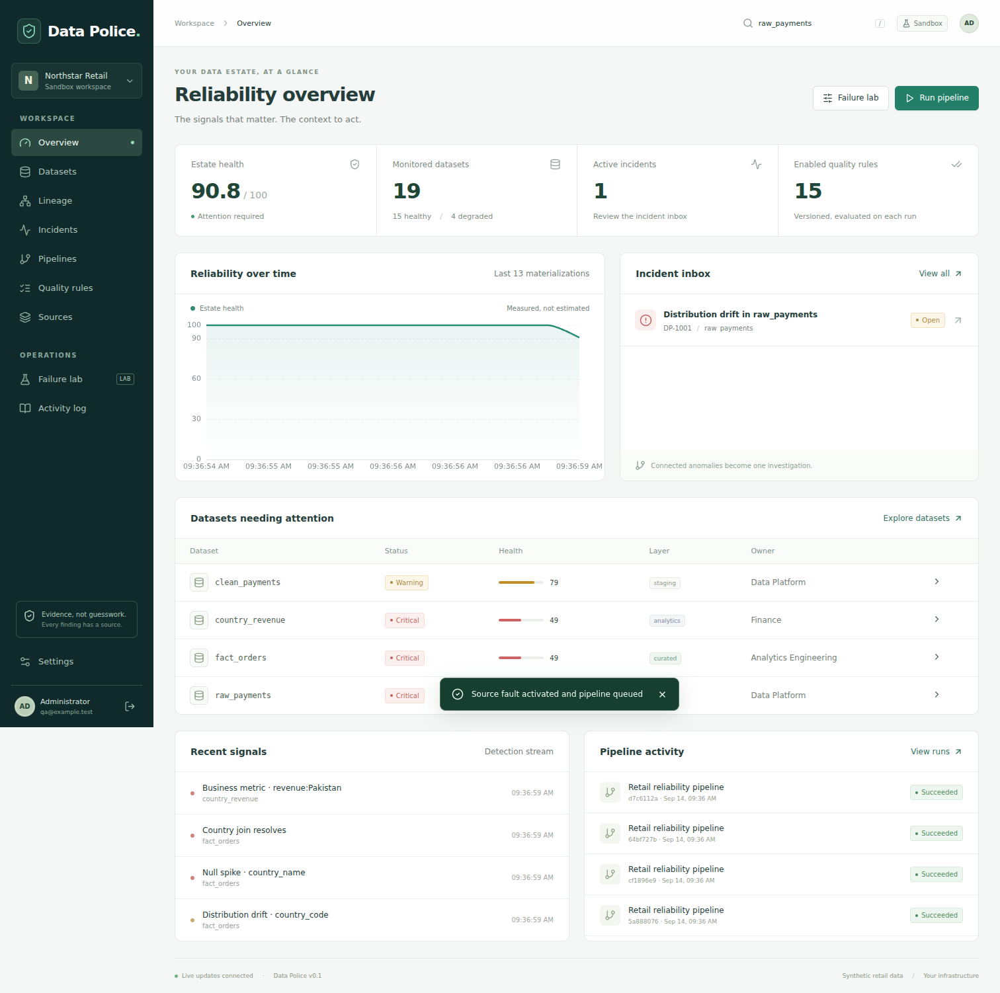
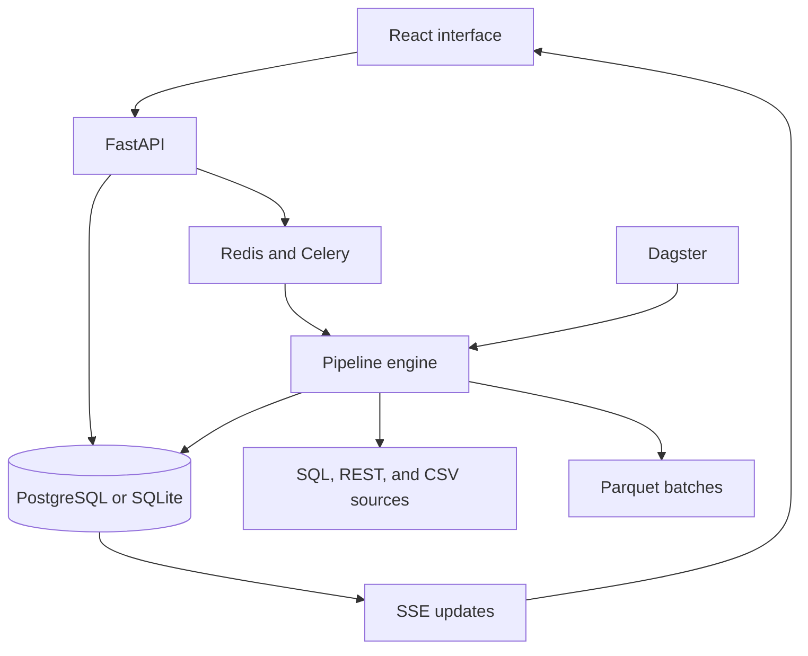

# Data Police

[](https://github.com/alitimusprime/data-police/actions/workflows/ci.yml)

**A self-hosted data reliability workspace for finding where a data problem started and what it affected.**

Data Police ingests a synthetic retail ecosystem through SQL, HTTP, and CSV interfaces. It stores immutable dataset batches, profiles their health, evaluates quality rules, detects anomalies, and groups related failures into incidents. The product interface brings the evidence, lineage, run history, and recovery status together in one place.



## What it includes

| Area          | Implementation                                                                                             |
| ------------- | ---------------------------------------------------------------------------------------------------------- |
| Ingestion     | Typed SQL tables, paginated REST endpoints, and checksummed CSV snapshots                                  |
| Processing    | Polars transformations and DuckDB SQL over committed Parquet files                                         |
| Data quality  | Eight declarative rule types with validation, versions, and per-run results                                |
| Profiling     | Row counts, schema, nulls, duplicates, cardinality, numeric summaries, distributions, and business metrics |
| Detection     | Schema drift, freshness, volume, null, duplicate, categorical, numeric, and business-metric checks         |
| Lineage       | One asset registry shared by execution, Dagster, persistence, and the interactive graph                    |
| Incidents     | Lineage-aware correlation, evidence records, root-cause ranking, ownership, notes, and verified recovery   |
| Investigation | Deterministic evidence reports plus an optional external AI provider with filtered inputs                  |
| Runtime       | FastAPI, PostgreSQL, Redis, Celery, Dagster, Parquet, React, and server-sent events                        |
| Operations    | Alembic migrations, Docker Compose, structured logs, health checks, tests, and GitHub Actions              |

The included Northstar Retail workspace contains 19 connected datasets and ten failure scenarios. It is synthetic, so the full workflow can be demonstrated without company data or paid services.

## Requirements

Choose either the full Docker stack or the lighter local profile.

|                   | Full Docker stack                                     | Local profile                             |
| ----------------- | ----------------------------------------------------- | ----------------------------------------- |
| Best for          | Complete product demonstration                        | Development and quick evaluation          |
| Platforms         | Linux, macOS, or Windows with Docker Desktop and WSL2 | Linux, macOS, Windows PowerShell, or WSL2 |
| Required          | Git, Python 3.12+, Docker with Compose v2             | Git, Python 3.12+, Node.js 22+, npm       |
| Database and jobs | PostgreSQL, Redis, and Celery                         | SQLite and an in-process worker           |
| Orchestration     | Dagster webserver and daemon                          | Built-in scheduler                        |

Docker Desktop already includes Docker Engine, the Docker CLI, and Compose. Linux users may install Docker Engine with the Compose plugin instead. Use the current stable release of each tool.

- [Docker Desktop and Compose](https://docs.docker.com/compose/install/)
- [Docker Engine for Linux](https://docs.docker.com/engine/install/)
- [Python downloads](https://www.python.org/downloads/)
- [Node.js downloads](https://nodejs.org/en/download)

The Python installation must include `pip` and the `venv` module. On Debian or Ubuntu, install the venv package that matches your Python version if it is not already present, for example `python3.12-venv`.

On Windows, the Docker workflow is most reliable inside a WSL2 Linux distribution with Docker Desktop integration enabled. The local SQLite profile can also run directly from PowerShell.

## Quick start with Docker

Clone the repository:

```bash
git clone https://github.com/alitimusprime/data-police.git
cd data-police
```

Create local credentials. On Linux, macOS, or WSL:

```bash
python3 scripts/bootstrap.py
```

On Windows PowerShell:

```powershell
py -3.12 scripts/bootstrap.py
```

If the Python Launcher for Windows is not installed, use `python` in place of `py -3.12` after confirming that `python --version` reports Python 3.12 or newer.

Bootstrap creates `.env` once and prints the administrator password. Running it again preserves the existing file.

Build and start the stack:

```bash
docker compose up --build -d
docker compose ps --all
```

The first startup builds the images, applies the database migration, starts the source services, and measures 12 baseline batches. Follow startup progress with:

```bash
docker compose logs --tail=60 seed
docker compose logs --tail=60 api worker monitor
```

Open the following addresses after `seed` finishes with exit code `0`:

| Service           | Address                                                                           |
| ----------------- | --------------------------------------------------------------------------------- |
| Data Police       | [http://localhost:8000](http://localhost:8000)                                    |
| Dagster           | [http://localhost:3001](http://localhost:3001)                                    |
| API documentation | [http://localhost:8000/api/docs](http://localhost:8000/api/docs) after signing in |

The default email is `admin@datapolice.local`. Use the password printed by the bootstrap command or read `DP_ADMIN_PASSWORD` from your private `.env` file.

Stop the services while keeping all saved data:

```bash
docker compose stop
```

Start them again with `docker compose up -d`. Avoid `docker compose down -v` unless you intentionally want to remove persistent volumes.

## Run without Docker

The local profile uses SQLite and the built-in worker. It still runs the SQL, HTTP, CSV, Parquet, profiling, detection, lineage, and incident workflows. PostgreSQL, Redis, Celery, and the Dagster services are only exercised by the Docker profile.

### Linux, macOS, or WSL

```bash
python3 -m venv .venv
source .venv/bin/activate
python -m pip install --upgrade pip
python -m pip install -r requirements.lock
cd web
npm ci
npm run build
cd ..
python scripts/bootstrap.py
python scripts/start_local.py
```

### Windows PowerShell

These commands use the virtual environment directly, so changing PowerShell's script execution policy is unnecessary.

```powershell
py -3.12 -m venv .venv
.\.venv\Scripts\python.exe -m pip install --upgrade pip
.\.venv\Scripts\python.exe -m pip install -r requirements.lock
Set-Location web
npm ci
npm run build
Set-Location ..
.\.venv\Scripts\python.exe scripts\bootstrap.py
.\.venv\Scripts\python.exe scripts\start_local.py
```

Open [http://localhost:8000](http://localhost:8000). Press `Ctrl+C` in the terminal to stop the local API, provider, and scheduler. The local profile and Docker profile keep separate database histories, and they should not run on port 8000 at the same time.

## Demonstration workflow

1. Open **Overview** and confirm that all 19 datasets have baseline measurements.
2. Open **Failure lab**, select **Country code change**, and choose **Inject & run**.
3. The payment source begins returning `PAK` where the country dimension expects `PK`. The resulting join and country-revenue failures are detected from the processed data.
4. Open the incident and inspect the ranked origin, score contributions, evidence records, affected assets, and lineage path.
5. Generate the investigation report. Verified observations, inference, and unproven hypotheses are shown separately.
6. Restore the healthy source and complete two clean runs. The incident moves through monitoring and then resolves.

The simulator changes source or transformation behavior. It does not insert incidents directly or overwrite dashboard values. Counts and monetary values vary between batches because the demo data is generated with a saved seed.

## How the services fit together



PostgreSQL stores operational state. Parquet stores immutable analytical batches. Redis transports jobs, while durable run records remain in the database. Dagster and manual product runs call the same execution engine and share the same asset contract.

## Repository layout

| Path                  | Contents                                                                         |
| --------------------- | -------------------------------------------------------------------------------- |
| `backend/data_police` | API, connectors, pipeline, profiling, quality, detection, lineage, and incidents |
| `web/src`             | React and TypeScript product interface                                           |
| `migrations`          | Alembic database migrations                                                      |
| `infra`               | PostgreSQL initialization and Dagster configuration                              |
| `tests`               | Backend and integration tests                                                    |
| `scripts`             | Bootstrap, local launcher, browser QA, audits, and release tooling               |
| `docs`                | Architecture, operations, product scope, verification evidence, and screenshots  |
| `compose.yaml`        | Full multi-service environment                                                   |

## Testing

The quickest checks are:

```bash
python -m pytest -q
cd web
npm run test
npm run build
```

The full test workflow, browser acceptance setup, and database safety rules are in [CONTRIBUTING.md](CONTRIBUTING.md). Recorded release evidence is in [docs/VERIFICATION.md](docs/VERIFICATION.md).

## Documentation

| Document                                     | Purpose                                                                |
| -------------------------------------------- | ---------------------------------------------------------------------- |
| [START_HERE.md](START_HERE.md)               | Detailed Windows and WSL setup guide                                   |
| [docs/ARCHITECTURE.md](docs/ARCHITECTURE.md) | Data flow, persistence, algorithms, and design decisions               |
| [docs/OPERATIONS.md](docs/OPERATIONS.md)     | Configuration, scheduling, backup, retention, and troubleshooting      |
| [docs/PRODUCT.md](docs/PRODUCT.md)           | Product workflow, scenarios, and release boundaries                    |
| [docs/VERIFICATION.md](docs/VERIFICATION.md) | Test evidence and remaining runtime checks                             |
| [CONTRIBUTING.md](CONTRIBUTING.md)           | Development setup and contribution checks                              |
| [SECURITY.md](SECURITY.md)                   | Security controls, deployment assumptions, and vulnerability reporting |

## Current scope

Version 0.1 is a single-workspace, single-administrator release. It does not include multi-tenant isolation, SSO, role-based access control, CDC, generic connector onboarding, column-level lineage, seasonal forecasting, automated retention, or a production availability guarantee. Root-cause scores are explainable evidence rankings, not calibrated probabilities or proof of causation.
