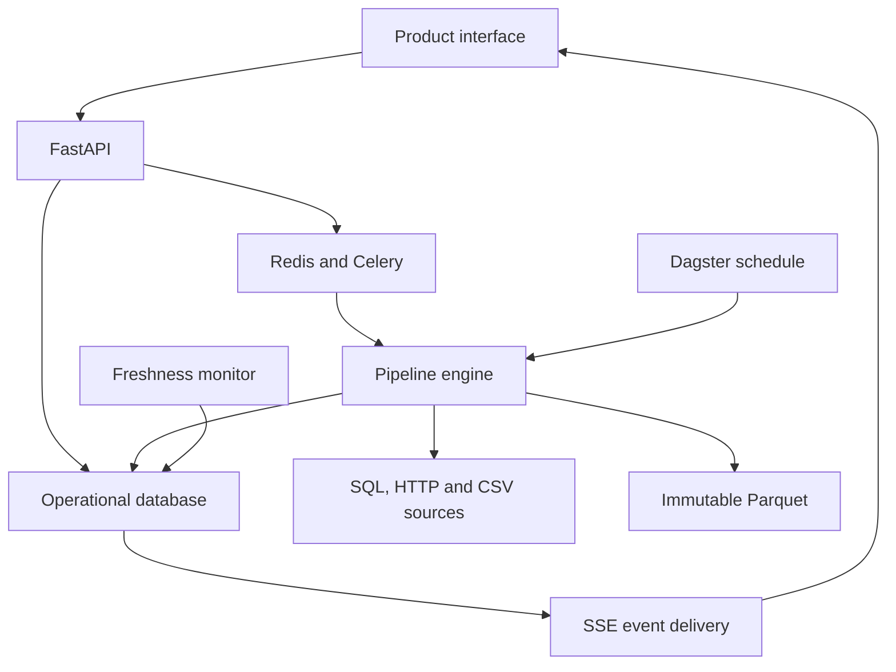
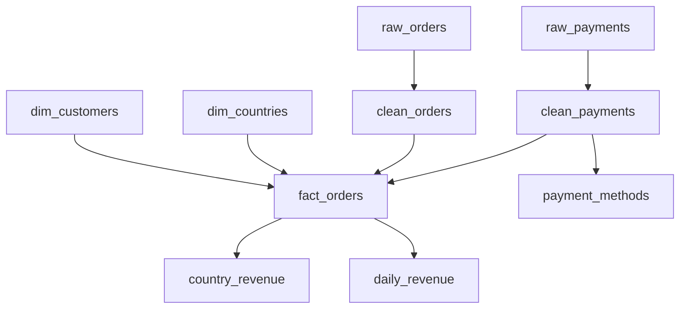

# Architecture and evidence model

## System boundaries

Data Police has a persistent control plane and an analytical data plane. PostgreSQL stores operational metadata in the complete stack. Immutable Parquet files store actual dataset batches. The lightweight profile replaces PostgreSQL with SQLite while retaining the same SQLAlchemy models and processing code.

Dagster calls the engine directly for its scheduled job. Manual product runs go through Celery in the complete stack. Both use the same database lease, run schema, asset registry, profiling and incident logic. Redis transports jobs; it is not the system of record and is not used as a decorative cache.

## Source and processing contract

The supplied ecosystem is Northstar Retail, with synthetic orders, order lines, customers, products, country keys, payments, shipments and inventory. Generation and ingestion are separate operations. The generator writes native typed SQL tables, the provider reads those tables through an HTTP service, and supplier inventory is exported to CSV before the connector reads it.

The ingestion contract is an immutable **batch snapshot** identified by a run. The SQL connector pages by `row_number` within `batch_id`, and the HTTP connector follows provider cursors. This is not a CDC engine or a cross-batch incremental watermark connector. Source batches are small enough to load into memory for Polars transformations.

The `ASSETS` registry in `catalog.py` defines 19 real assets and their parents. Execution iterates that registry in dependency order, and the same definition becomes database lineage edges and Dagster `AssetSpec` dependencies. There is no separate hand-drawn application graph.

This scoped graph shows the country-join investigation path. Additional assets cover order lines, product revenue, shipments and inventory. Joins preserve unexpected country codes for investigation. The country aggregation labels unresolved revenue `Unmatched`; the daily aggregate retains that revenue. A reporting-category failure therefore does not silently discard the money.

## Persistence and job correctness

| Record or storage | Purpose |
| --- | --- |
| datasets, lineage_edges | Asset registry, ownership, current health and dependency metadata |
| pipeline_runs, job_leases | Durable work identity, scenario snapshot, seed, timing, stage outcomes and mutual exclusion |
| dataset_profiles | Per-run schema, statistics, health components, checksum and Parquet path |
| quality_rules, quality_rule_versions, quality_results | Validated expectations, historical definitions and measured results |
| anomalies | Immutable monitor outputs linked to a dataset and run |
| incidents, incident_anomalies | Correlated investigations and their observations |
| evidence, root_cause_candidates, investigations | Traceable facts, score contributions and generated reports |
| incident_events, change_events, product_events | Operator/detection timeline, configuration changes and durable UI events |
| warehouse/layer/asset/run.parquet | Actual immutable analytical batch |

Run idempotency keys are unique. Completed, failed and paused runs are terminal. Redelivery of a completed run does not create extra profiles. A interrupted run can resume from profiles already committed for that run, loading their Parquet files before downstream work. Retries of a terminal failed batch create a new run.

The engine uses a database compare-and-swap lease with a ten-minute expiry and renews it between assets. One materialization operates on the workspace at a time. Celery uses late acknowledgements, a single prefetch and a nine-minute hard task limit. The monitor redrives pending database records every minute. This supplies at-least-once delivery with idempotent effects, not a blanket exactly-once guarantee.

A Parquet file is first written to a temporary path, then renamed before its profile is committed. The file and database are not in a distributed transaction. A crash between file rename and database commit can leave an unreferenced file. Redelivery may overwrite that uncommitted run path, but committed profiles are reused. No automated orphan cleanup is included.

## Profiling and detection

Row count, duplicate rate, nulls, cardinality and selected summaries scan the complete loaded batch. Numeric distribution tests use at most 512 deterministic sampled values per selected column. Categorical distributions are retained for columns with at most 40 distinct values; active distribution monitors use selected business columns. Timestamp ranges are derived from the supplied normalized ISO timestamp strings, not inferred event-time watermarks.

Rules run immediately, including during warm-up. Statistical detection requires at least **eight healthy profiles** and uses up to the **12 most recent healthy profiles** for that dataset. Schema differences are checked against the most recent healthy profile even before statistical warm-up is complete. Healthy means a profile score of at least 90.

| Monitor | Version 1 definition |
| --- | --- |
| Schema | Added, removed or observed-type-changed columns relative to the previous healthy profile |
| Volume | Median plus/minus the maximum of six scaled MADs, 25% of the median, or one row |
| Null rate | Current rate exceeds the baseline median by more than eight percentage points |
| Duplicate rate | Current extra-row fraction exceeds baseline by more than five percentage points |
| Categorical distribution | Squared base-2 Jensen-Shannon distance, equivalent to JS divergence; threshold greater than 0.12 |
| Numeric distribution | Two-sample KS on bounded samples; effect size greater than 0.30 and p-value below 0.01 |
| Country revenue | Robust baseline bounds with a 40% relative floor and 100-unit absolute floor |
| Freshness | Time since successful materialization exceeds the configured threshold; default 180 seconds |

Schema types describe observed dataframe types. A column inferred as Null because every incoming value is missing is not proof of a physical database DDL migration. Freshness monitors ingestion arrival, not an upstream event-time SLA. Statistical thresholds are practical heuristics. They are not calibrated for seasonal traffic, multiple-testing control or arbitrary production workloads.

## Health score

Each component starts at 100 and is reduced by its failing rules or anomalies. The weighted total uses freshness 20%, completeness 15%, validity 15%, uniqueness 10%, schema 15%, volume 10% and distribution 15%.

A failed critical rule caps the dataset at 59. A critical anomaly caps it at 49; a warning anomaly caps it at 79. This prevents a serious failure from disappearing inside an average. The UI shows individual components and rules so that the number remains explainable. Estate health is an average of measured dataset scores, not a contractual service-level objective.

## Correlation, ranking and recovery

Related anomalies enter an active incident only when their datasets have a directed lineage relationship and the incident was updated within 30 minutes. A shared timestamp alone is insufficient. The current greedy grouping can merge coincident faults in one dependency chain or split complex multi-root failures. It is deliberately limited to the supplied single-workspace ecosystem.

Candidate roots must themselves have an observed anomaly. Upstream candidates without direct observed failures are not invented. Candidates receive up to 100 evidence points:

| Signal | Maximum | Calculation |
| --- | ---: | --- |
| Upstream position | 25 | Full points if no observed anomalous ancestor; otherwise 25% of the maximum |
| Affected paths explained | 30 | Fraction of observed assets reachable from the candidate, including itself |
| Direct failure evidence | 20 | Full points for schema, quality or pipeline failure evidence; otherwise 65% |
| Independent monitor types | 15 | Distinct monitor kinds divided by three, capped at one |
| Observed severity | 10 | Full points for a critical observation; otherwise 60% |

The UI shows each contribution. **95/100 is an evidence rank, not 95% probability.** Graph order and source-contract evidence support an investigation starting point; they do not prove causality.

Observed impact is the set of datasets with incident anomalies. Potential impact is additional reachable downstream assets without recorded anomalies. Recovery requires two consecutive successful healthy materializations of every observed affected dataset. Related anomalies reset the counter. An operator can assign an incident, add notes and start investigation, but cannot bypass the recovery check by clicking Resolve.

## Investigator boundary

The default investigator deterministically assembles a structured report from stored evidence. It works without an LLM, and does not pretend to be a trained ML model.

With an explicitly configured provider, the operator can request AI suggestions. The provider receives selected evidence and candidate rankings. Failed-row samples and arbitrary nested details are excluded; numeric aggregate details are allowlisted. Dataset identifiers, contract descriptions and monitor metadata are still sent. This is data minimization, not a universal anonymization system.

Model output must match a Pydantic report schema and cite only known evidence IDs. The backend retains its own verified facts and summary and uses the model only for inference, hypotheses and recommendations. It never lets generated text rewrite evidence or scores. Valid evidence IDs do not guarantee a semantically correct suggestion.

## Design decisions

| Decision | Reason and tradeoff |
| --- | --- |
| React/TypeScript with Vite | A private dashboard needs no server-side SEO rendering. FastAPI serves the compiled app on one origin, reducing routing and authentication setup. Next.js is not used. |
| PostgreSQL plus Parquet | PostgreSQL supports transactional operational records; Parquet supplies immutable analytical batches. This release is not a warehouse query service. |
| Polars plus DuckDB | Polars handles typed transforms and profiling; DuckDB performs an actual SQL aggregate over committed Parquet. Both are used by the execution path. |
| Custom declarative rules | A small typed rule evaluator keeps expected/observed results and evidence under one contract. It does not reimplement the full Great Expectations or Soda ecosystems. |
| One Dagster multi-asset operation | Dagster schedules and records 19 real asset materializations while the engine owns recovery checkpoints. Individual asset retries/subset runs are not offered in Dagster v0.1. |
| Deterministic statistical methods | Thresholds, baselines and ranking are inspectable. No pretrained anomaly model, Isolation Forest or forecasting model is claimed. |
| Database-backed SSE events | Live UI events can replay after reconnect. Redis is reserved for jobs. One-second database polling is acceptable for a small workspace, with a clear scale limit. |

Future scale work should add partitioned ingestion, source-specific cursor state, incremental profiling, retention, distributed concurrency control by pipeline, versioned graph evolution and tenant authorization before broad connector onboarding.
